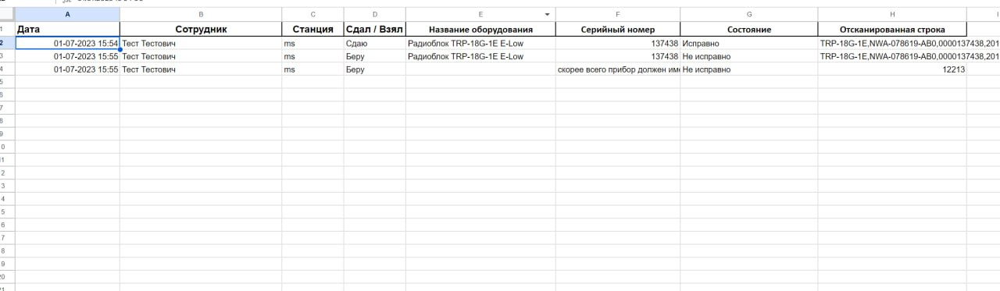

<h1>Анализатор сканов с интерфейсом</h1>
интерфейс реализован с помощью pyside (tkinter сделан только шаблон)
  Кроме этого есть более легковесная форма - в консольном виде.
  Обе версии создают txt и xls файлы (в случае интерфейса это резервные копии)
  А в интерфейсе основой является гугл-таблица для многопользовательского доступа
  В интерфейсе есть прогрессбар, состояния работы, проверка языка заполнения форм
<h3>Пример работы:</h3>

 

